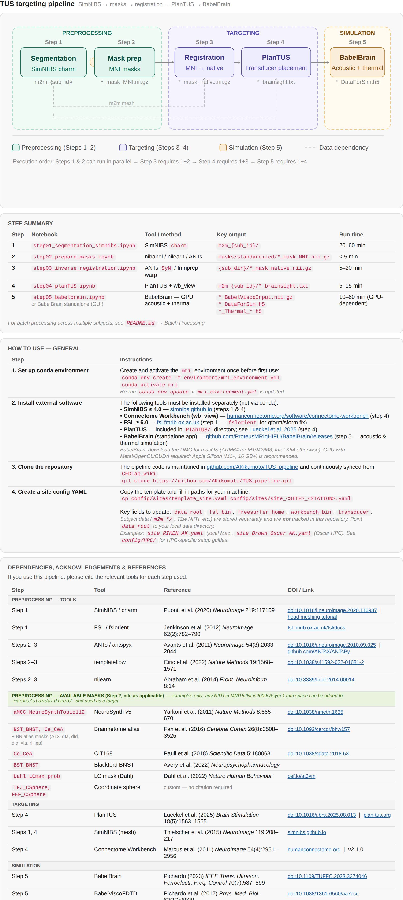

# TUS Analysis — Overview

This directory contains scripts for TUS (Transcranial Ultrasound Stimulation) target planning and analysis. See [README_PLAN.md](README_PLAN.md) for the full pipeline design document and restructuring plan.

[](https://akikumoto.github.io/TUS_pipeline/notebook/z_references/pipeline_reference.html)

---

## Analysis Pathways

The pipeline has multiple parallel pathways. Choose based on your site configuration (see `config/sites/`).

### Step 1 — Segmentation

> [📋 Step 1 reference card](https://akikumoto.github.io/TUS_pipeline/notebook/z_references/step1_reference.html)

Two methods are available:

| Method | Notebook | Output | Use when |
|--------|----------|--------|----------|
| **SimNIBS** | `run/TUS_segmentation_SimNINBS.ipynb` | `m2m_{sub_id}/final_tissues.nii.gz` | Standard T1 scan (preferred) |
| **SPM** *(optional)* | `run/TUS_segmentation_SPM.ipynb` | `c1–c6*.nii` tissue maps | When SimNIBS is unavailable, or when additional flexibility is needed (e.g. PETRA images for bone segmentation at 7T or with implants) |

SPM steps: N4 bias correction → `NewSegment` → labeling → RAS reorientation

SimNIBS steps (requires terminal):
```bash
fslorient -copysform2qform T1.nii.gz   # optional: fix sform/qform
charm [subid] T1.nii.gz
```

---

### Step 2 — MNI Mask Generation

> [📋 Step 2 reference card](https://akikumoto.github.io/TUS_pipeline/notebook/z_references/step2_reference.html)

**Notebook:** `run/step02_prepare_masks.ipynb`

Generates target ROI masks in MNI space (`MNI152NLin2009cAsym`, 1 mm iso). Four independent method cells — run only the cell(s) needed.

| Cell | Method | Inputs | Examples |
|------|--------|--------|----------|
| **2a** | NeuroSynth z-map + bounding box | `masks/original/` z-map NIfTI | aMCC |
| **2b** | Web / nilearn atlas ROI by label name | Downloaded via nilearn at runtime | HO ACC/Insula; Juelich; BN atlas |
| **2c** | Existing file ROI reorient + resample | NIfTI in `masks/original/` | BNST, CeA, LC |
| **2d** | Coordinate sphere at MNI mm coords | MNI coordinates + radius | IFJ, FEF |

The QC cell (last) works for any output mask: verifies grid (193×229×193, 1 mm), prints voxel count, renders interactive viewer + tri-planar PNG.

**Step 2b atlas options** (`ATLAS` variable):
- `"HO_cort"` / `"HO_sub"` — Harvard-Oxford cortical / subcortical (nilearn)
- `"Juelich"` — Juelich cytoarchitectonic (nilearn)
- `"BN"` — Brainnetome 246-region atlas (local; `$NILEARN_DATA/bn/`)

All outputs land in `masks/standardized/`.

---

### Step 3 — Inverse Registration (MNI → Native) + Target Coordinate

> [📋 Step 3 reference card](https://akikumoto.github.io/TUS_pipeline/notebook/z_references/step3_reference.html)

**Notebook:** `run/step3_inverse_registration.ipynb`

Warps any MNI-space mask into subject-native T1 space, then computes a target coordinate for TUS/TMS targeting. Covers Steps 3–5 of the overall pipeline.

#### Registration mode (`REGISTRATION_MODE`)

| Mode | When to use | Transform source |
|---|---|---|
| `"ants"` | No fmriprep; run ANTs from scratch | Computed here, saved to `ants_transforms/` |
| `"fmriprep"` | fmriprep already run; reuse its warp | `.h5` file from `fmriprep/sub-*/anat/` |

**ANTs-mode options:**

| Parameter | Options | Default |
|---|---|---|
| `INTENSITY_NORM` | `"histogram_match"` / `"imath_normalize"` / `"none"` | `"histogram_match"` (3T) |
| `REGISTRATION_TYPE` | `"SyN"` / `"SyNCC"` | `"SyN"` |

#### Target coordinate mode (`TARGET_MODE`)

| Setting | Method |
|---|---|
| `"CoM"` | Centre of mass of the thresholded native mask (`compute_com_native`) |
| `"peak_func"` | Peak voxel of a functional map within the native mask (`compute_peak_native`) |
| `"skip"` | No coordinate; output native mask only |

**Inputs:**
- Site YAML (`config/sites/`)
- Subject native T1 NIfTI (auto-located via site config)
- MNI-space mask (`masks/standardized/`) — must be MNI152NLin2009cAsym 1 mm
- *fmriprep mode only*: `*_from-MNI152NLin2009cAsym_to-T1w_mode-image_xfm.h5`
- *peak_func mode only*: functional contrast map in MNI space

**Outputs:**
- `<sub_dir>/<sub_id>_<MASK_LABEL>_mask_native.nii.gz`
- `<sub_dir>/<sub_id>_<FUNC_MAP_LABEL>_native.nii.gz` *(peak_func only)*
- `<sub_dir>/figures/<sub_id>_<MASK_LABEL>_native_overlay.png`
- `<sub_dir>/figures/<sub_id>_MNI2native_regcheck.png` *(ANTs mode only)*

---

### Step 4 — Optimizing Target Specification

> [📋 Step 4 reference card](https://akikumoto.github.io/TUS_pipeline/notebook/z_references/step4_reference.html)

**Notebook:** `notebook/step04_planTUS.ipynb`  
**Script:** `src/run_planTUS.py`

Uses the SimNIBS head mesh to find the optimal transducer placement for a given target ROI — accounting for skull geometry, beam angle, and avoidance regions. All transducer parameters are read from `config/transducers/` YAML; all paths from the site YAML.

Run via the notebook, or from the command line:

```bash
# simnibs_python = Python interpreter bundled with SimNIBS
# (set simnibs_python in your site YAML, e.g. .../SimNIBS-4.5/simnibs_env/bin/python)
# When running inside the mri conda env with SimNIBS pip-installed, use python directly.
python src/run_planTUS.py \
    --site   config/sites/site_RIKEN_AK.yaml \
    --sub    sub-NS \
    --target aMCC_NeuroSynthTopic112 \
    --side   _R
```

- Inspect outputs in Workbench (`scene.scene`): transducer angle, skull distance, avoidance maps
- `write_brainsight_txt()` exports Brainsight `.txt` with entry + focus coordinates for neuronavigation
- *Requires SimNIBS segmentation from Step 1*

---

### Step 5 — Acoustic & Thermal Simulation (BabelBrain)

**Tool:** [BabelBrain](https://proteusmrighifu.github.io/BabelBrain/) (standalone GUI application)

**Notebook:** `notebook/step05_babelbrain.ipynb` — batch mode (no GUI). Runs domain generation (5a), acoustic simulation (5b), and thermal simulation (5c) via BabelBrain Python API.

**Install:** Download from [GitHub Releases](https://github.com/ProteusMRIgHIFU/BabelBrain/releases)
- macOS ARM64 (M1/M2/M3) or Intel X64 — pick the correct DMG for your hardware
- No Python installation required (standalone app)
- Open the DMG → double-click the package installer → authorize in macOS Security settings if prompted

**Requirements:**
- GPU with Metal (macOS), OpenCL, or CUDA support
- Apple Silicon (M1+, 16 GB+ RAM) is recommended
- SimNIBS ≥ 4.0 segmentation output (`m2m_{sub_id}/`) from Step 1
- Brainsight ≥ 2.5.3 or 3DSlicer trajectory (from Step 4 output `*_brainsight.txt`)

**Inputs:**
- `m2m_{sub_id}/` — SimNIBS head mesh (from Step 1)
- Brainsight trajectory `.txt` (from Step 4) — or load trajectory directly in Brainsight ≥ 2.5.3 which can call BabelBrain directly

**Outputs:**
- `pressure_*.nii.gz` — acoustic pressure field in subject space
- Thermal maps — temperature rise estimates

**Running:**
1. Open BabelBrain from Applications (macOS) or Start Menu (Windows)
2. Load the SimNIBS `m2m_{sub_id}/` output directory
3. Import the Brainsight trajectory (or use the Brainsight ≥ 2.5.3 direct integration)
4. Select transducer model and exposure parameters (see `config/transducers/` for lab specs)
5. Run simulation; results are saved to the output directory

**Alternative tools:**

| Tool | Acoustic | Thermal | Notes |
|------|----------|---------|-------|
| **BabelBrain** | Yes | Yes | Standalone GUI; Apple Silicon recommended |
| **Brainsight** | Yes | Yes | Integrated with neuronavigation (uses BabelBrain internally since v2.5.3) |
| **kWave** (MATLAB) | Yes | — | MATLAB-based, more flexible scripting |

BabelBrain is the primary tool for Step 5 in this pipeline.

---

## Batch Processing — `src/` run scripts &nbsp; ⚠ UNDER TESTING

Steps 1, 3, and 4 can be run non-interactively from the command line using the run scripts in `src/`. These are intended for multi-subject batch jobs and automated pipelines. All scripts use the same `--site` YAML and share a common CLI structure.

> **Requires** the `mri` conda environment (`conda activate mri_env`) and SimNIBS 4.6+ installed in it.

| Script | Step | Description |
|--------|------|-------------|
| `src/run_prepall.py` | 1 + 3 + 4 | Master orchestrator — runs any combination of steps in sequence for one or more subjects |
| `src/run_seg.py` | 1 | SimNIBS `charm` segmentation (single subject) |
| `src/run_reg.py` | 3 | ANTs inverse registration: MNI mask → native space |
| `src/run_com.py` | 4a | Centre-of-Mass targeting + BrainSight `.txt` export |
| `src/run_planTUS.py` | 4b | PlanTUS automated transducer placement |

### Quick start — single subject

```bash
conda activate mri_env
cd scripts/TUS

# Full pipeline (seg + reg + plantus) for one subject:
python src/run_prepall.py \
    --site       config/sites/site_RIKEN_AK.yaml \
    --mask       masks/standardized/aMCC_NeuroSynthTopic112_mask_MNI.nii.gz \
    --mask-label aMCC_NeuroSynthTopic112 \
    --subjects   sub-NS \
    --steps      seg,reg,plantus

# Alternatively, run individual steps:
python src/run_seg.py    --site config/sites/site_RIKEN_AK.yaml --sub sub-NS
python src/run_reg.py    --site config/sites/site_RIKEN_AK.yaml --sub sub-NS \
                         --mask masks/standardized/aMCC_NeuroSynthTopic112_mask_MNI.nii.gz \
                         --mask-label aMCC_NeuroSynthTopic112
python src/run_com.py    --site config/sites/site_RIKEN_AK.yaml --sub sub-NS \
                         --mask-label aMCC_NeuroSynthTopic112
python src/run_planTUS.py --site config/sites/site_RIKEN_AK.yaml --sub sub-NS \
                          --target aMCC_NeuroSynthTopic112 --side _R
```

### Multi-subject batch — pipeline YAML (recommended)

Create a `pipeline.yaml` file (see docstring in `src/run_prepall.py` for full format):

```yaml
site:           config/sites/site_RIKEN_AK.yaml
mask:           masks/standardized/aMCC_NeuroSynthTopic112_mask_MNI.nii.gz
mask_label:     aMCC_NeuroSynthTopic112
target_side:    _R
steps:          [seg, reg, com, plantus]
subjects:
  - sub_id: sub-01
  - sub_id: sub-02
  - sub_id: sub-03
```

```bash
python src/run_prepall.py --config pipeline.yaml [--dry-run]
```

Use `--dry-run` to preview the commands that would be run without executing them.

---

## Directory Structure

```
scripts/TUS/
  config/                  ← site and transducer configuration (YAML)
    transducers/           ← CTX500_RIKEN.yaml, DPX500_UMD.yaml  (naming: MODEL_SITE.yaml)
    sites/                 ← site_RIKEN_AK.yaml, site_UMD_AK.yaml, template_site.yaml  (naming: site_[SITE]_[STATION].yaml)
  run/                     ← analysis notebooks and scripts (active)
    step01_segmentation_simnibs.py        ← CLI script (automated, single or batch)
    step01_segmentation_simnibs.ipynb     ← interactive notebook (step-by-step)
    test_step01_segmentation_simnibs.py   ← pre/post-run validation checks
    step02_prepare_masks.ipynb            ← MNI mask generation: 2a NeuroSynth, 2b atlas, 2c file ROI, 2d CSphere
    step3_inverse_registration.ipynb      ← MNI→native registration + target coordinate (Steps 3–5)
    step04_plantus_run.py                 ← config-driven PlanTUS wrapper (Step 4, GUI)
    step05_babelbrain.ipynb               ← acoustic & thermal simulation via BabelBrain (batch, no GUI)
    TUS_segmentation_SimNINBS.ipynb       ← QA + PlanTUS interactive notebook
    TUS_segmentation_SPM.ipynb            ← SPM segmentation pathway
    (legacy notebooks moved to z_old_scripts/)
    TUS_aMCCmask.ipynb                    ← legacy: MNI mask gen (Step 2 only, replaced by step02)
  PlanTUS/                 ← PlanTUS wrapper scripts
  masks/original/          ← target ROI masks in original/subject space
  masks/standardized/          ← target ROI masks in MNI standard space
  src/                     ← shared functions (future)
  z_examples/              ← reference implementation (Xin)
  z_old_scripts/           ← archived notebooks
```

---

## Site-Specific Configuration

Hardware and software settings per site are documented in `config/sites/`:

| Site | Transducer | Config file |
|------|-----------|-------------|
| RIKEN | CTX-500 (SN:056) | `config/sites/site_RIKEN_AK.yaml` |
| UMD | DPX-500 (SN:048) | `config/sites/site_UMD_AK.yaml` |
| Brown | DPX-500 | TBD |
| Iowa | CTX-500 + DPX-500 | TBD |
| Other | — | `config/sites/template_site.yaml` |

Transducer specs (focal depths, FLHM, calibration data) are in `config/transducers/`. Source PDFs are in `resources/TUS/setup/`.

### Available Masks

MNI152NLin2009cAsym 1 mm. See [masks/standardized/LIST_mask_standard.md](masks/standardized/LIST_mask_standard.md) for QC images and details. Set `atlases_dir` in your site config YAML to point to your local copy of the MNI atlases (not tracked in this repository).

| Mask label | Region | Atlas / source | Citation | DOI / URL |
|---|---|---|---|---|
| `aMCC_NeuroSynthTopic112` | Anterior mid-cingulate cortex | NeuroSynth v5 | Yarkoni et al. (2011) *Nature Methods* 8:665–670 | doi:10.1038/nmeth.1635 |
| `aMCC_bounding_box` | Anterior mid-cingulate cortex | Manual bounding box | custom | — |
| `BST_BNST` | Bed nucleus of the stria terminalis | Blackford BNST | Avery et al. (2022) *Neuropsychopharmacology* | — |
| `Ce_CeA` | Central nucleus of the amygdala | CIT168 | Pauli et al. (2018) *Scientific Data* 5:180063 | doi:10.1038/sdata.2018.63 |
| `FEF_CSphere` | Frontal Eye Field | Coordinate sphere | custom | — |
| `IFJ_CSphere` | Inferior Frontal Junction | Coordinate sphere | custom | — |
| `LC` | Locus coeruleus | LC meta-mask (Dahl) | Dahl et al. (2022) *Nature Human Behaviour* | osf.io/at3ym |
| `dIa_L_OR_dIa_R_BN` | Dorsal agranular insula | Brainnetome atlas | Fan et al. (2016) *Cerebral Cortex* 26(8):3508–3526 | doi:10.1093/cercor/bhw157 |
| `dId_L_OR_dId_R_BN` | Dorsal dysgranular insula | Brainnetome atlas | Fan et al. (2016) *Cerebral Cortex* 26(8):3508–3526 | doi:10.1093/cercor/bhw157 |
| `dIg_L_OR_dIg_R_BN` | Dorsal granular insula | Brainnetome atlas | Fan et al. (2016) *Cerebral Cortex* 26(8):3508–3526 | doi:10.1093/cercor/bhw157 |
| `vIa_L_OR_vIa_R_BN` | Ventral agranular insula | Brainnetome atlas | Fan et al. (2016) *Cerebral Cortex* 26(8):3508–3526 | doi:10.1093/cercor/bhw157 |
| `A13_L_OR_A13_R_BN` | OFC area 13 | Brainnetome atlas | Fan et al. (2016) *Cerebral Cortex* 26(8):3508–3526 | doi:10.1093/cercor/bhw157 |
| `rHipp_L_OR_rHipp_R_BN` | Rostral hippocampus | Brainnetome atlas | Fan et al. (2016) *Cerebral Cortex* 26(8):3508–3526 | doi:10.1093/cercor/bhw157 |
| `rHipp_L_OR_rHipp_R_OR_cHipp_L_OR_cHipp_R_BN` | Rostral + caudal hippocampus | Brainnetome atlas | Fan et al. (2016) *Cerebral Cortex* 26(8):3508–3526 | doi:10.1093/cercor/bhw157 |

---

## Software Dependencies

### Python environment

```bash
conda activate mri_env   # see mri_environment.yml for full package list
```

| Package | Used in |
|---------|---------|
| `nibabel` | All steps — NIfTI I/O |
| `nilearn` | Steps 2–3 — atlas fetching, image resampling |
| `antspy` | Step 3 — SyN registration |
| `numpy`, `scipy` | All steps |
| `matplotlib` | QA plots |
| `pyyaml` | Config loading |
| `nipype` | Step 1 (SPM path) — SPM12 interface |
| `pandas` | Step 4 (CoM output CSV) |
| `trimesh`, `vtk` | Step 4 (PlanTUS) |

### External tools

| Tool | Version | Used in | Notes |
|------|---------|---------|-------|
| **SimNIBS** | ≥ 4.0 | Step 1 (SimNIBS path), Step 4 (PlanTUS) | Provides `charm` binary and Python env |
| **FSL** | ≥ 6.0 | Step 1 — `fslorient` | Optional: qform/sform fix |
| **SPM12** | r7771+ | Step 1 (SPM path) | Via MATLAB or standalone MCR |
| **Connectome Workbench** | ≥ 1.5 | Step 4 (PlanTUS) — scene inspection | |
| **FreeSurfer** | ≥ 8.0 | Step 4 (PlanTUS) | |
| **Brainsight** | ≥ 2.5.3 | Step 4 (trajectory export), Step 5 (neuronavigation + calls BabelBrain) | |
| **BabelBrain** | ≥ 0.3.4 | Step 5 — acoustic &amp; thermal simulation | Standalone app; Apple Silicon recommended; download from [GitHub Releases](https://github.com/ProteusMRIgHIFU/BabelBrain/releases) |
| **kWave** (MATLAB) | ≥ 1.4 | Step 5 (alternative) | MATLAB R2020b+ |

---

## src/utils.py — API Reference

See [src/LIST_functions.md](src/LIST_functions.md) for the full function reference.

---

## Resources

| Tool / Method | Citation |
|---------------|----------|
| **Murphy et al. (2025) — ITRUSST TUS guide** | Murphy KR et al. (2025). *A practical guide to transcranial ultrasonic stimulation — State of the art and opportunities.* Clin Neurophysiol 171:192–226. [doi:10.1016/j.clinph.2025.01.004](https://doi.org/10.1016/j.clinph.2025.01.004) |
| **SimNIBS / charm** | Thielscher A, Antunes A, Saturnino GB. (2015). *Field modeling for transcranial magnetic stimulation.* EMBC. [doi:10.1109/EMBC.2015.7318340](https://doi.org/10.1109/EMBC.2015.7318340) |
| **ANTs SyN registration** | Avants BB et al. (2011). *A reproducible evaluation of ANTs similarity metric performance.* NeuroImage. [doi:10.1016/j.neuroimage.2010.09.025](https://doi.org/10.1016/j.neuroimage.2010.09.025) |
| **PlanTUS** | Lueckel M et al. (2023). *PlanTUS: A software for patient-specific transcranial ultrasound stimulation planning.* [doi:10.1101/2023.04.05.535674](https://doi.org/10.1101/2023.04.05.535674) |
| **kWave** | Treeby BE, Cox BT. (2010). *k-Wave: MATLAB toolbox for the simulation of acoustic wave fields.* J Acoust Soc Am. [doi:10.1121/1.3360308](https://doi.org/10.1121/1.3360308) |

**Local resources:**
- `resources/TUS/setup/` — hardware test reports (PDF)
- `resources/TUS/manuscripts/` — reference papers
- `z_examples/Example(Xin)/` — reference implementation

---

## Local Modifications to PlanTUS

The PlanTUS source (`PlanTUS/code/PlanTUS.py`) has been patched locally to maintain compatibility with the lab environment. Changes are documented below.

| Date | File | Line(s) | Change | Reason |
|------|------|---------|--------|--------|
| 2026-03-19 | `PlanTUS/code/PlanTUS.py` | 600–602 | `np.string_` → `np.bytes_` (3 occurrences in `create_kps_file_for_kPlan`) | `np.string_` was removed in NumPy 2.0; `np.bytes_` is the direct replacement |
| 2026-03-20 | `PlanTUS/code/PlanTUS.py` | 563–570 | Added `"..."` quotes around all path arguments in `transform_surface_model`'s two `os.system()` calls | `surface_model_filepath` points to `Dropbox (Personal)/...` which contains a space; unquoted paths in shell commands are split at spaces, silently producing no output file |
| 2026-03-20 | `src/utils.py` | `subprocess.Popen` in `run_plantus` | Added four Qt5 HiDPI env vars to wb_view launch: `QT_AUTO_SCREEN_SCALE_FACTOR=0`, `QT_SCALE_FACTOR=1`, `QT_ENABLE_HIGHDPI_SCALING=0`, `QT_FONT_DPI=96` | On macOS Retina displays, Qt5 double-scales the window, collapsing panels and misaligning click targets; all four variables are required to suppress this |
| 2026-03-20 | `src/utils.py` | `run_plantus` | Made `pynput` optional via `use_pynput` parameter (default `True`); falls back to direct stderr parsing when `pynput` is unavailable or Accessibility permissions are not granted | `pynput` silently drops events without Accessibility permissions; `use_pynput=False` bypasses the listener and parses wb_view FINER log directly |
| 2026-03-22 | `src/utils.py` | `write_brainsight_txt` `_row()` | Fixed rotation matrix column order: `m{col}n{row}` = `R[row, col]` → now writes column-by-column (`R[:,0]`, `R[:,1]`, `R[:,2]`) instead of row-by-row | BrainSight/BabelBrain convention is column-major; previous code wrote R^T, causing incorrect transducer beam orientation in BabelBrain acoustic simulation. Neuronavigation (XYZ only) was unaffected. Same bug existed in the original legacy notebook (`z_old_scripts/TUS_aMCCmask.ipynb`). |
| 2026-03-22 | `config/sites/site_RIKEN_AK.yaml`, `site_UMD_AK.yaml` | line 11 | `coordinate_system: "NIfTI:Scanner"` → `"NIfTI:S:Scanner"` | BabelBrain ≥ v14 validates the coordinate system header string against a known list; `"NIfTI:Scanner"` matches none and would cause `EndWithError` in Brainsight-integration mode. Version 13 files skip this check, so existing navigation was unaffected. |
| 2026-03-23 | `PlanTUS/PlanTUS_wrapper.py` | entire file | Unified the two device-specific wrapper scripts (`PlanTUS_wrapper_CTX500.py`, `PlanTUS_wrapper_DPX500.py`) into a single `argparse`-driven script. All transducer parameters (focal depth, F#, calibration) and site paths are now read from the site and transducer config YAMLs via `--site YAML`. The two original files are archived in `z_old_scripts/`. | Eliminated code duplication and hardcoded paths. One script now works with any site configuration; adding a new site or transducer requires only a new YAML, not a new wrapper. |

> These patches are not upstreamed. If PlanTUS is updated, re-apply these changes and update this table.

---

## Local Modifications to SimNIBS

SimNIBS 4.6.0 is installed in the `mri` conda env at:
`/Users/atsushikikumoto/miniforge3/envs/mri/lib/python3.11/site-packages/simnibs/`

**Root issue**: `brain_surface.py` builds external-binary commands as f-strings and then calls `cmd.split()` to tokenize them before passing to `spawn_process`. On paths containing spaces (e.g., `Dropbox (Personal)/...`), `split()` breaks the path into separate tokens, causing the binary to receive malformed arguments and silently fail.

| Date | File | Line(s) | Change | Reason |
|------|------|---------|--------|--------|
| 2026-04 | `segmentation/brain_surface.py` | ~184 | `spawn_process(cmd.split())` → `spawn_process([str(cat_surf2sphere), str(sph_map_white), str(sphere), "10"])` for the CAT_Surf2Sphere call | `cmd.split()` splits `Dropbox (Personal)/...` on the space, breaking the path into two tokens. List-based argument passing avoids shell tokenisation entirely. |
| 2026-04 | `segmentation/brain_surface.py` | ~206 | `spawn_process(cmd.split())` → `spawn_process([str(cat_warpsurf), "-steps", "2", "-avg", "-i", str(white), "-is", str(sphere), "-t", str(fsavg_white), "-ts", str(fsavg_sphere), "-ws", str(sphere_reg)])` for the CAT_WarpSurf call | Same root cause as above. |

> These patches target SimNIBS 4.6.0. If SimNIBS is updated via `pip install --upgrade simnibs`, `brain_surface.py` will be overwritten and the patches must be re-applied.
>
> Note: using a `~/Dropbox` symlink does **not** bypass this bug — Python's `Path.resolve()` follows symlinks back to the real path containing spaces before the value is ever substituted into the f-string.

---

## Local Modifications to wb_view.app

System-level changes to the wb_view installation at `/Applications/workbench/macosxub_apps/wb_view.app/`.
A backup of each file is kept alongside the original (`.bak` suffix).

| Date | File | Change | Reason |
|------|------|--------|--------|
| 2026-03-20 | `Contents/Info.plist` | Added `NSHighResolutionCapable = false` | Without this key, macOS passes the full Retina device pixel ratio (2×) to Qt5, which then applies its own scaling on top — resulting in a double-scaled window where panels collapse and clicks are misaligned. External monitors are unaffected. To revert: `sudo cp Info.plist.bak Info.plist` |

---

## Contact

**Atsushi Kikumoto, Ph.D.**  
Research Associate, Badre Lab — Department of Cognitive, Linguistic, and Psychological Sciences, Brown University  

Assistant Professor (incoming August 2026), Cognitive Flexibility Dynamics Lab — Department of Psychology, University of Maryland, College Park

- Email: atsushi_kikumoto [at] brown.edu
- Lab website: TBD
- Google Scholar: [Atsushi Kikumoto](https://scholar.google.com/citations?user=KMp4Ni8AAAAJ&hl=en)
- ORCID: [0000-0002-2179-2700](https://orcid.org/0000-0002-2179-2700)
- GitHub: [AKikumoto](https://github.com/AKikumoto)

For bug reports or questions, please open a [GitHub Issue](https://github.com/AKikumoto/TUS_pipeline/issues).
