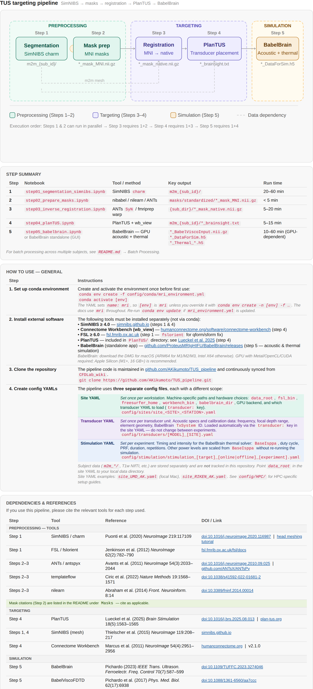

# TUS Analysis: Overview

This directory contains scripts for TUS (Transcranial Ultrasound Stimulation) target planning and analysis.

[](https://akikumoto.github.io/TUS_pipeline/notebook/z_references/pipeline_reference.html)

## Table of Contents

- [Analysis Pathways](#analysis-pathways)
- [Batch Processing, `src/` run scripts &nbsp; ⚠ UNDER TESTING](#batch-processing-src-run-scripts----under-testing)
- [Directory Structure](#directory-structure)
- [Masks](#masks)
- [Software Dependencies](#software-dependencies)
- [Resources](#resources)
- [Source and Local Modifications](#source-and-local-modifications)
- [Acknowledgements](#acknowledgements)
- [Contact](#contact)

---

## Analysis Pathways

The pipeline has multiple parallel pathways. Choose based on your site configuration (see `config/sites/`).

### Step 1: Segmentation

> [📋 Step 1 reference card](https://akikumoto.github.io/TUS_pipeline/notebook/z_references/step1_reference.html)

Two methods are available:

| Method | Notebook | Output | Use when |
|--------|----------|--------|----------|
| **SimNIBS** | `run/TUS_segmentation_SimNINBS.ipynb` | `m2m_{sub_id}/final_tissues.nii.gz` | Standard T1 scan (preferred) |
| **SPM** *(optional)* | `run/TUS_segmentation_SPM.ipynb` | `c1–c6*.nii` tissue maps | When SimNIBS is unavailable, or when additional flexibility is needed (e.g. PETRA images for bone segmentation at 7T or with implants) |

SPM steps: N4 bias correction → `NewSegment` → labeling → RAS reorientation

SimNIBS steps (requires terminal):
```bash
fslorient -copysform2qform T1.nii.gz   # optional: fix sform/qform
charm [subid] T1.nii.gz
```

---

### Step 2: MNI Mask Generation

> [📋 Step 2 reference card](https://akikumoto.github.io/TUS_pipeline/notebook/z_references/step2_reference.html)

**Notebook:** `run/step02_prepare_masks.ipynb`

Generates target ROI masks in MNI space (`MNI152NLin2009cAsym`, 1 mm iso). Four independent method cells, run only the cell(s) needed.

| Cell | Method | Inputs | Examples |
|------|--------|--------|----------|
| **2a** | NeuroSynth z-map + bounding box | `masks/original/` z-map NIfTI | aMCC |
| **2b** | Web / nilearn atlas ROI by label name | Downloaded via nilearn at runtime | HO ACC/Insula; Juelich; BN atlas |
| **2c** | Existing file ROI reorient + resample | NIfTI in `masks/original/` | BNST, CeA, LC |
| **2d** | Coordinate sphere at MNI mm coords | MNI coordinates + radius | IFJ, FEF |

The QC cell (last) works for any output mask: verifies grid (193×229×193, 1 mm), prints voxel count, renders interactive viewer + tri-planar PNG.

**Step 2b atlas options** (`ATLAS` variable):
- `"HO_cort"` / `"HO_sub"`, Harvard-Oxford cortical / subcortical (nilearn)
- `"Juelich"`: Juelich cytoarchitectonic (nilearn)
- `"BN"`: Brainnetome 246-region atlas (local; `$NILEARN_DATA/bn/`)

All outputs land in `masks/standardized/`.

---

### Step 3: Inverse Registration (MNI → Native) + Target Coordinate

> [📋 Step 3 reference card](https://akikumoto.github.io/TUS_pipeline/notebook/z_references/step3_reference.html)

**Notebook:** `run/step3_inverse_registration.ipynb`

Warps any MNI-space mask into subject-native T1 space, then computes a target coordinate for TUS/TMS targeting. Covers Steps 3–5 of the overall pipeline.

#### Registration mode (`REGISTRATION_MODE`)

| Mode | When to use | Transform source |
|---|---|---|
| `"ants"` | No fmriprep; run ANTs from scratch | Computed here, saved to `ants_transforms/` |
| `"fmriprep"` | fmriprep already run; reuse its warp | `.h5` file from `fmriprep/sub-*/anat/` |

**ANTs-mode options:**

| Parameter | Options | Default |
|---|---|---|
| `INTENSITY_NORM` | `"histogram_match"` / `"imath_normalize"` / `"none"` | `"histogram_match"` (3T) |
| `REGISTRATION_TYPE` | `"SyN"` / `"SyNCC"` | `"SyN"` |

#### Target coordinate mode (`TARGET_MODE`)

| Setting | Method |
|---|---|
| `"CoM"` | Centre of mass of the thresholded native mask (`compute_com_native`) |
| `"peak_func"` | Peak voxel of a functional map within the native mask (`compute_peak_native`) |
| `"skip"` | No coordinate; output native mask only |

**Inputs:**
- Site YAML (`config/sites/`)
- Subject native T1 NIfTI (auto-located via site config)
- MNI-space mask (`masks/standardized/`), must be MNI152NLin2009cAsym 1 mm
- *fmriprep mode only*: `*_from-MNI152NLin2009cAsym_to-T1w_mode-image_xfm.h5`
- *peak_func mode only*: functional contrast map in MNI space

**Outputs:**
- `<sub_dir>/<sub_id>_<MASK_LABEL>_mask_native.nii.gz`
- `<sub_dir>/<sub_id>_<FUNC_MAP_LABEL>_native.nii.gz` *(peak_func only)*
- `<sub_dir>/figures/<sub_id>_<MASK_LABEL>_native_overlay.png`
- `<sub_dir>/figures/<sub_id>_MNI2native_regcheck.png` *(ANTs mode only)*

---

### Step 4: Optimizing Target Specification

> [📋 Step 4 reference card](https://akikumoto.github.io/TUS_pipeline/notebook/z_references/step4_reference.html)

**Notebook:** `notebook/step04_planTUS.ipynb`  
**Script:** `src/run_planTUS.py`

Uses the SimNIBS head mesh to find the optimal transducer placement for a given target ROI, accounting for skull geometry, beam angle, and avoidance regions. All transducer parameters are read from `config/transducers/` YAML; all paths from the site YAML.

Run via the notebook, or from the command line:

```bash
# simnibs_python = Python interpreter bundled with SimNIBS
# (set simnibs_python in your site YAML, e.g. .../SimNIBS-4.5/simnibs_env/bin/python)
# When running inside the mri conda env with SimNIBS pip-installed, use python directly.
python src/run_planTUS.py \
    --site   config/sites/site_RIKEN_AK.yaml \
    --sub    sub-NS \
    --target aMCC_NeuroSynth112 \
    --side   _R
```

- Inspect outputs in Workbench (`scene.scene`): transducer angle, skull distance, avoidance maps
- `write_brainsight_txt()` exports Brainsight `.txt` with entry + focus coordinates for neuronavigation
- *Requires SimNIBS segmentation from Step 1*

---

### Step 5: Acoustic & Thermal Simulation (BabelBrain)

**Tool:** [BabelBrain](https://proteusmrighifu.github.io/BabelBrain/) (standalone GUI application)

**Notebook:** `notebook/step05_babelbrain.ipynb`, batch mode (no GUI). Runs domain generation (5a), acoustic simulation (5b), and thermal simulation (5c) via BabelBrain Python API.

**Install:** Download from [GitHub Releases](https://github.com/ProteusMRIgHIFU/BabelBrain/releases)
- macOS ARM64 (M1/M2/M3) or Intel X64, pick the correct DMG for your hardware
- No Python installation required (standalone app)
- Open the DMG → double-click the package installer → authorize in macOS Security settings if prompted

**Requirements:**
- GPU with Metal (macOS), OpenCL, or CUDA support
- Apple Silicon (M1+, 16 GB+ RAM) is recommended
- SimNIBS ≥ 4.0 segmentation output (`m2m_{sub_id}/`) from Step 1
- Brainsight ≥ 2.5.3 or 3DSlicer trajectory (from Step 4 output `*_brainsight.txt`)

**Inputs:**
- `m2m_{sub_id}/`: SimNIBS head mesh (from Step 1)
- Brainsight trajectory `.txt` (from Step 4), or load trajectory directly in Brainsight ≥ 2.5.3 which can call BabelBrain directly

**Outputs:**
- `pressure_*.nii.gz`: acoustic pressure field in subject space
- Thermal maps, temperature rise estimates

**Running:**
1. Open BabelBrain from Applications (macOS) or Start Menu (Windows)
2. Load the SimNIBS `m2m_{sub_id}/` output directory
3. Import the Brainsight trajectory (or use the Brainsight ≥ 2.5.3 direct integration)
4. Select transducer model and exposure parameters (see `config/transducers/` for lab specs)
5. Run simulation; results are saved to the output directory

**Alternative tools:**

| Tool | Acoustic | Thermal | Notes |
|------|----------|---------|-------|
| **BabelBrain** | Yes | Yes | Standalone GUI; Apple Silicon recommended |
| **Brainsight** | Yes | Yes | Integrated with neuronavigation (uses BabelBrain internally since v2.5.3) |
| **kWave** (MATLAB) | Yes | — | MATLAB-based, more flexible scripting |

BabelBrain is the primary tool for Step 5 in this pipeline.

---

## Batch Processing: `src/` run scripts &nbsp; ⚠ UNDER TESTING

Steps 1, 3, 4 and 5 can be run non-interactively from the command line using the run scripts in `src/`. These are intended for multi-subject batch jobs and automated pipelines. All scripts use the same `--site` YAML and share a common CLI structure.

> **Requires** the `mri` conda environment (`conda activate mri`) and SimNIBS 4.6+ installed in it.

| Script | Step | Description |
|--------|------|-------------|
| `src/run_prepall.py` | 1 + 3 + 4 | Master orchestrator, runs any combination of steps in sequence for one or more subjects |
| `src/run_seg.py` | 1 | SimNIBS `charm` segmentation (single subject) |
| `src/run_reg.py` | 3 | ANTs inverse registration: MNI mask → native space |
| `src/run_com.py` | 4a | Centre-of-Mass targeting + BrainSight `.txt` export |
| `src/run_planTUS.py` | 4b | PlanTUS automated transducer placement |
| `src/run_sweep.py` | 5 | Solves a shortlist of candidate vertices and ranks them (`--n-shortlist`, `--sep-mm`, `--top-pct`, `--seed-vtx`) |
| `src/run_babelbrain.py` | 5 | BabelBrain acoustic and thermal simulation for one vertex (`--vtx`, `--ppw`, `--z-beyond`, `--skip-thermal`) |

> **`run_prepall.py` orchestrates steps 1–4 only**. Its `--steps` accepts `seg`, `reg`, `com`
> and `plantus`. The two Step 5 scripts are run separately, once a placement exists.

### Quick start: single subject

```bash
conda activate mri
cd scripts/TUS

# Full pipeline (seg + reg + plantus) for one subject:
python src/run_prepall.py \
    --site       config/sites/site_RIKEN_AK.yaml \
    --mask       masks/standardized/aMCC_NeuroSynth112_mask_MNI.nii.gz \
    --mask-label aMCC_NeuroSynth112 \
    --subjects   sub-NS \
    --steps      seg,reg,plantus

# Alternatively, run individual steps:
python src/run_seg.py    --site config/sites/site_RIKEN_AK.yaml --sub sub-NS
python src/run_reg.py    --site config/sites/site_RIKEN_AK.yaml --sub sub-NS \
                         --mask masks/standardized/aMCC_NeuroSynth112_mask_MNI.nii.gz \
                         --mask-label aMCC_NeuroSynth112
python src/run_com.py    --site config/sites/site_RIKEN_AK.yaml --sub sub-NS \
                         --mask-label aMCC_NeuroSynth112
python src/run_planTUS.py --site config/sites/site_RIKEN_AK.yaml --sub sub-NS \
                          --target aMCC_NeuroSynth112 --side _R
```

### Multi-subject batch: pipeline YAML (recommended)

Create a `pipeline.yaml` file (see docstring in `src/run_prepall.py` for full format):

```yaml
site:           config/sites/site_RIKEN_AK.yaml
mask:           masks/standardized/aMCC_NeuroSynth112_mask_MNI.nii.gz
mask_label:     aMCC_NeuroSynth112
target_side:    _R
steps:          [seg, reg, com, plantus]
subjects:
  - sub_id: sub-01
  - sub_id: sub-02
  - sub_id: sub-03
```

```bash
python src/run_prepall.py --config pipeline.yaml [--dry-run]
```

Use `--dry-run` to preview the commands that would be run without executing them.

---

## Directory Structure

```
scripts/TUS/
  config/                  ← site and transducer configuration (YAML)
    transducers/           ← CTX500_RIKEN.yaml, DPX500_UMD.yaml  (naming: MODEL_SITE.yaml)
    sites/                 ← site_RIKEN_AK.yaml, site_UMD_AK.yaml, template_site.yaml  (naming: site_[SITE]_[STATION].yaml)
  run/                     ← analysis notebooks and scripts (active)
    step01_segmentation_simnibs.py        ← CLI script (automated, single or batch)
    step01_segmentation_simnibs.ipynb     ← interactive notebook (step-by-step)
    test_step01_segmentation_simnibs.py   ← pre/post-run validation checks
    step02_prepare_masks.ipynb            ← MNI mask generation: 2a NeuroSynth, 2b atlas, 2c file ROI, 2d CSphere
    step3_inverse_registration.ipynb      ← MNI→native registration + target coordinate (Steps 3–5)
    step04_plantus_run.py                 ← config-driven PlanTUS wrapper (Step 4, GUI)
    step05_babelbrain.ipynb               ← acoustic & thermal simulation via BabelBrain (batch, no GUI)
    TUS_segmentation_SimNINBS.ipynb       ← QA + PlanTUS interactive notebook
    TUS_segmentation_SPM.ipynb            ← SPM segmentation pathway
    (legacy notebooks moved to z_old_scripts/)
    TUS_aMCCmask.ipynb                    ← legacy: MNI mask gen (Step 2 only, replaced by step02)
  PlanTUS/                 ← PlanTUS wrapper scripts
  masks/original/          ← target ROI masks in original/subject space
  masks/standardized/          ← target ROI masks in MNI standard space
  src/                     ← shared functions (future)
  z_examples/              ← reference implementation (Xin)
  z_old_scripts/           ← archived notebooks
```

---

## Masks

Standard space is `MNI152NLin2009cAsym`, 1 mm (193×229×193). The current list, with QC images,
sources and citations, is in
[masks/standardized/LIST_mask_standard.md](masks/standardized/LIST_mask_standard.md): that
file is generated alongside the masks and is the one to trust.

Naming is `{structure}_{source}[_{parameter}]_mask_MNI.nii.gz`. **Masks are bilateral and carry
no side in the name**: `run_reg.py` splits them into `_L`/`_R` in native space and everything
downstream selects with `--side`.

Set `atlases_dir` in your site config YAML to point at your own copy of the MNI atlases; they
are not tracked here.

### Citations

Examples only, any NIfTI in `MNI152NLin2009cAsym` 1 mm space can be added to
`masks/standardized/` and used as a target. Cite as applicable.

| Mask | Source | Citation |
|---|---|---|
| `aMCC_NeuroSynth112` | NeuroSynth v5 | Yarkoni et al. (2011) *Nature Methods* 8:665–670, [doi:10.1038/nmeth.1635](https://doi.org/10.1038/nmeth.1635) |
| `A13_BN`, `dIa_BN`, `dId_BN`, `dIg_BN`, `vIa_BN`, `rHipp_BN`, `cHipp_BN`, `hipp_BN` | Brainnetome atlas | Fan et al. (2016) *Cerebral Cortex* 26(8):3508–3526, [doi:10.1093/cercor/bhw157](https://doi.org/10.1093/cercor/bhw157) |
| `CeA_CIT168` | CIT168 | Pauli et al. (2018) *Scientific Data* 5:180063, [doi:10.1038/sdata.2018.63](https://doi.org/10.1038/sdata.2018.63) |
| `BNST_Blackford2022` | Blackford BNST | Avery et al. (2022) *Neuropsychopharmacology* |
| `LC_Dahl2022` | LC mask (Dahl) | Dahl et al. (2022) *Nature Human Behaviour*, [osf.io/at3ym](https://osf.io/at3ym/) |
| `IFJ_sphere8`, `FEF_sphere8` | Coordinate sphere (8 mm) | custom, no citation required |
| `alEC_Maass2015`, `pmEC_Maass2015` | Entorhinal subdivision | Maass et al. (2015) *eLife* 4:e06426, [doi:10.7554/eLife.06426](https://doi.org/10.7554/eLife.06426) |
| `aHipp_Weizhen_p01`, `aHipp_Weizhen_p05` | Anterior hippocampus | left-only; `p05` is the larger threshold |

---

## Software Dependencies

### Python environment

```bash
conda activate mri   # see mri_environment.yml for full package list
```

| Package | Used in |
|---------|---------|
| `nibabel` | All steps, NIfTI I/O |
| `nilearn` | Steps 2–3, atlas fetching, image resampling |
| `antspy` | Step 3, SyN registration |
| `numpy`, `scipy` | All steps |
| `matplotlib` | QA plots |
| `pyyaml` | Config loading |
| `nipype` | Step 1 (SPM path), SPM12 interface |
| `pandas` | Step 4 (CoM output CSV) |
| `trimesh`, `vtk` | Step 4 (PlanTUS) |

### External tools

| Tool | Version | Used in | Notes |
|------|---------|---------|-------|
| **SimNIBS** | ≥ 4.0 | Step 1 (SimNIBS path), Step 4 (PlanTUS) | Provides `charm` binary and Python env |
| **FSL** | ≥ 6.0 | Step 1, `fslorient` | Optional: qform/sform fix |
| **SPM12** | r7771+ | Step 1 (SPM path) | Via MATLAB or standalone MCR |
| **Connectome Workbench** | ≥ 1.5 | Step 4 (PlanTUS), scene inspection | |
| **FreeSurfer** | ≥ 8.0 | Step 4 (PlanTUS) | |
| **Brainsight** | ≥ 2.5.3 | Step 4 (trajectory export), Step 5 (neuronavigation + calls BabelBrain) | |
| **BabelBrain** | ≥ 0.3.4 | Step 5, acoustic &amp; thermal simulation | **Batch/notebook mode:** git clone (see below). GUI mode: download from [GitHub Releases](https://github.com/ProteusMRIgHIFU/BabelBrain/releases) |
| **kWave** (MATLAB) | ≥ 1.4 | Step 5 (alternative) | MATLAB R2020b+ |

> **BabelBrain, batch mode setup (macOS, `mri` conda env)**
>
> `step05_babelbrain.ipynb` uses BabelBrain via its Python API (no GUI). This requires the **git clone**, not the `.app` bundle:
>
> ```bash
> git clone https://github.com/ProteusMRIgHIFU/BabelBrain.git ~/BabelBrain
> ```
>
> Then install the additional pip packages that are not in `mri_environment.yml`:
>
> ```bash
> pip install SimpleITK linetimer==0.1.5 pwlf==2.5.2
> ```
>
> Reference: `~/BabelBrain/environment_mac_arm64-311.yml` lists the full BabelBrain dependency set.
> Set `babelbrain_dir: "~/BabelBrain"` in your site YAML (already set for UMD/RIKEN). The notebook adds this path to `sys.path` automatically at import time.

---

## Resources

| Tool / Method | Citation |
|---------------|----------|
| **Murphy et al. (2025), ITRUSST TUS guide** | Murphy KR et al. (2025). *A practical guide to transcranial ultrasonic stimulation, State of the art and opportunities.* Clin Neurophysiol 171:192–226. [doi:10.1016/j.clinph.2025.01.004](https://doi.org/10.1016/j.clinph.2025.01.004) |
| **SimNIBS / charm** | Thielscher A, Antunes A, Saturnino GB. (2015). *Field modeling for transcranial magnetic stimulation.* EMBC. [doi:10.1109/EMBC.2015.7318340](https://doi.org/10.1109/EMBC.2015.7318340) |
| **ANTs SyN registration** | Avants BB et al. (2011). *A reproducible evaluation of ANTs similarity metric performance.* NeuroImage. [doi:10.1016/j.neuroimage.2010.09.025](https://doi.org/10.1016/j.neuroimage.2010.09.025) |
| **PlanTUS** | Lueckel M et al. (2023). *PlanTUS: A software for patient-specific transcranial ultrasound stimulation planning.* [doi:10.1101/2023.04.05.535674](https://doi.org/10.1101/2023.04.05.535674) |
| **kWave** | Treeby BE, Cox BT. (2010). *k-Wave: MATLAB toolbox for the simulation of acoustic wave fields.* J Acoust Soc Am. [doi:10.1121/1.3360308](https://doi.org/10.1121/1.3360308) |

**Local resources:**
- `resources/TUS/setup/`: hardware test reports (PDF)
- `resources/TUS/manuscripts/`: reference papers
- `z_examples/Example(Xin)/`: reference implementation

---

## Source and Local Modifications

| File | Contents |
|------|----------|
| [src/LIST_functions.md](src/LIST_functions.md) | Every function in `src/utils.py`, grouped by pipeline step |
| [src/LIST_modifications.md](src/LIST_modifications.md) | Patch log for PlanTUS, SimNIBS and wb_view |

> Patches are not upstreamed. Re-apply after any upstream update.

### Portability Rule

**All fixes and workarounds must be portable**, i.e., they must work for any user who sets up the environment from scratch using `mri_environment.yml`.

- Do **not** edit files under `site-packages/`, `~/miniforge3/`, or any path outside this repository
- Third-party package bugs must be addressed via runtime patches in `src/utils.py` or a dedicated module in `src/`
- Document every patch in [src/LIST_modifications.md](src/LIST_modifications.md) with: affected package, version, symptom, and fix

---

## Acknowledgements

This pipeline was developed with contributions from the following collaborators.

| Name | Affiliation | Contribution | Links |
|------|------------|--------------|-------|
| **Takahiro Osada** | Associate Professor, Dept. of Neurophysiology, Juntendo University, Tokyo, Japan | TUS pipeline development and methodology | [ORCID 0000-0002-3743-3200](https://orcid.org/0000-0002-3743-3200) |
| **Zonghao Xin** | JSPS Postdoctoral Fellow, RIKEN CBS, Japan | Reference implementation (`src/z_dont_edit/Example(Xin)/`) | — |

---

## Contact

**Atsushi Kikumoto**  
Assistant Professor, Cognitive Flexibility Dynamics Lab, Department of Psychology, University of Maryland, College Park

- Email: akikumot [at] umd.edu
- Lab: [cfd-lab.com](https://www.cfd-lab.com/home)
- GitHub: [AKikumoto](https://github.com/AKikumoto)
- ORCID: [0000-0002-2179-2700](https://orcid.org/0000-0002-2179-2700)

For bug reports, please open a [GitHub Issue](https://github.com/AKikumoto/TUS_pipeline/issues).
