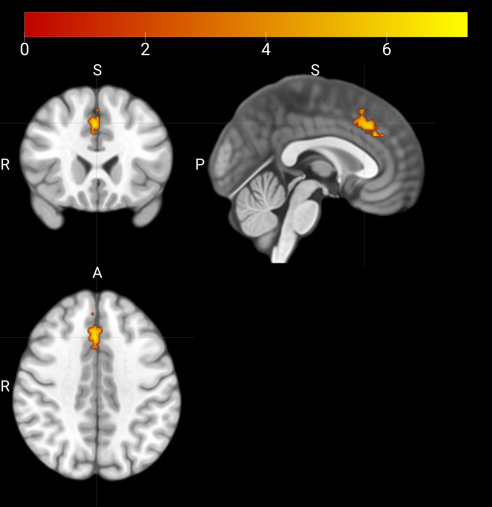
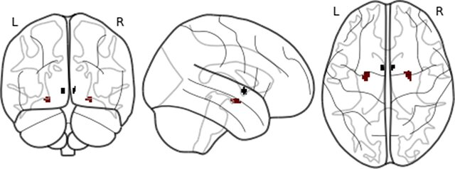
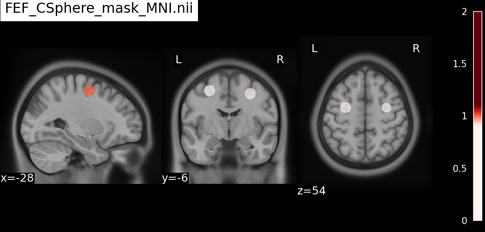
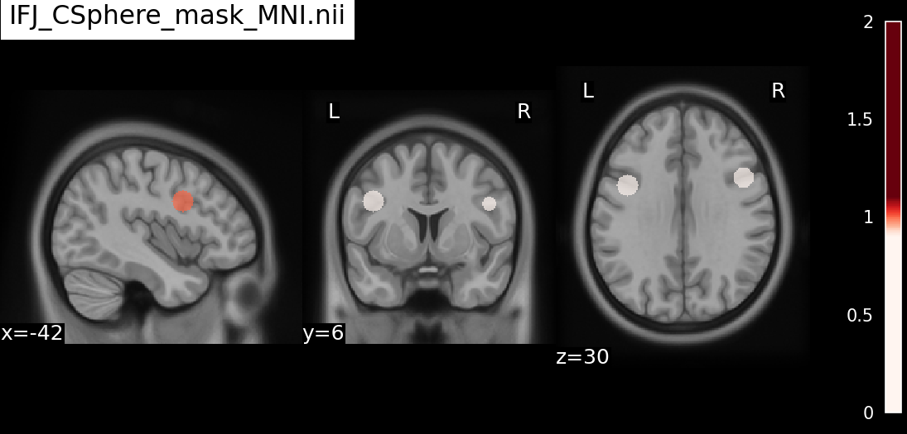
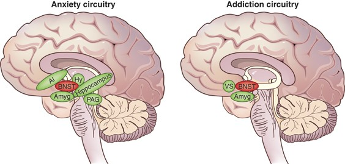

# masks/standardized/ — Usable Mask List

Space: `MNI152NLin2009cAsym` res=1mm (shape 193×229×193)  
Generated by: `run/step02_prepare_masks.ipynb`  
Updated: 2026-03-22

---

## 1. aMCC — Anterior Mid-Cingulate Cortex

### aMCC_NeuroSynthTopic112_mask_MNI.nii.gz

| Item | Detail |
|---|---|
| ROI | Anterior mid-cingulate cortex (aMCC) — NeuroSynth topic 112 (cognitive control) |
| Source | NeuroSynth topic map `v5-topics-400_112_*.nii.gz`, thresholded + bounding box applied |
| Created | 2025-07-17 |
| Notebook | `z_old_scripts/TUS_aMCCmask.ipynb` |

---

### aMCC_bounding_box_mask_MNI.nii.gz

| Item | Detail |
|---|---|
| ROI | Anterior mid-cingulate cortex (aMCC) — hand-drawn bounding box |
| Source | Manually defined bounding box around aMCC in MNI space |
| Created | 2025-07-17 |
| Notebook | `z_old_scripts/TUS_aMCCmask.ipynb` |

---

## 2. BST / BNST — Bed Nucleus of the Stria Terminalis

### BST_BNST_mask_MNI.nii.gz

| Item | Detail |
|---|---|
| ROI | Bed nucleus of the stria terminalis (BNST), bilateral |
| Source | Blackford et al. 2022 BNST mask (3T, ANTs-registered) |
| Created | 2026-03-22 |
| Notebook | `z_old_scripts/TUS_amygdala_mask.ipynb` |

---

## 3. Ce / CeA — Central Nucleus of the Amygdala

### Ce_CeA_mask_MNI.nii.gz

| Item | Detail |
|---|---|
| ROI | Central nucleus of the amygdala (CeA), bilateral |
| Source | CIT168 atlas, bilateral CeA (partial volume) |
| Created | 2026-03-22 |
| Notebook | `z_old_scripts/TUS_amygdala_mask.ipynb` |

*(see BST reference image above)*

---

## 4. FEF — Frontal Eye Field

### FEF_CSphere_mask_MNI.nii.gz

| Item | Detail |
|---|---|
| ROI | Frontal Eye Field (FEF), bilateral spheres r=8mm |
| Source | Coordinate-based sphere (MNI peak coords from literature) |
| Created | 2026-03-22 |
| Notebook | `run/step02_prepare_masks.ipynb` Step 2d |

---

## 5. IFJ — Inferior Frontal Junction

### IFJ_CSphere_mask_MNI.nii.gz

| Item | Detail |
|---|---|
| ROI | Inferior Frontal Junction (IFJ), bilateral spheres r=8mm |
| Source | Coordinate-based sphere (MNI peak coords from literature) |
| Created | 2026-03-22 |
| Notebook | `run/step02_prepare_masks.ipynb` Step 2d |

---

## 6. LC — Locus Coeruleus

### LC_mask_MNI.nii.gz

| Item | Detail |
|---|---|
| ROI | Locus coeruleus (LC), bilateral — 76 voxels |
| Source | Dahl et al. 2022 LC meta-mask (`metaMask_Dahl2022/LCmetaMask_MNI05_s01f_plus50.nii.gz`), resampled to 1mm NLin2009cAsym |
| Created | 2026-03-22 |
| Notebook | `run/step02_prepare_masks.ipynb` Step 2c |

---

## 7. Insula — Brainnetome Atlas (BN)

### dIa_L_OR_dIa_R_BN_mask_MNI.nii.gz

| Item | Detail |
|---|---|
| ROI | Dorsal agranular insula (dIa), bilateral — 3905 voxels |
| Source | Brainnetome Atlas (BN) 246-region, 1mm |
| Created | 2026-03-22 |
| Notebook | `run/step02_prepare_masks.ipynb` Step 2b |

---

### dId_L_OR_dId_R_BN_mask_MNI.nii.gz

| Item | Detail |
|---|---|
| ROI | Dorsal dysgranular insula (dId), bilateral — 5315 voxels |
| Source | Brainnetome Atlas (BN) 246-region, 1mm |
| Created | 2026-03-22 |
| Notebook | `run/step02_prepare_masks.ipynb` Step 2b |

---

### dIg_L_OR_dIg_R_BN_mask_MNI.nii.gz

| Item | Detail |
|---|---|
| ROI | Dorsal granular insula (dIg), bilateral — 4434 voxels |
| Source | Brainnetome Atlas (BN) 246-region, 1mm |
| Created | 2026-03-22 |
| Notebook | `run/step02_prepare_masks.ipynb` Step 2b |

---

### vIa_L_OR_vIa_R_BN_mask_MNI.nii.gz

| Item | Detail |
|---|---|
| ROI | Ventral agranular insula (vIa), bilateral — 3559 voxels |
| Source | Brainnetome Atlas (BN) 246-region, 1mm |
| Created | 2026-03-22 |
| Notebook | `run/step02_prepare_masks.ipynb` Step 2b |

---

## 8. OFC — Orbitofrontal Cortex

### A13_L_OR_A13_R_BN_mask_MNI.nii.gz

| Item | Detail |
|---|---|
| ROI | OFC area 13 (A13), bilateral — 13755 voxels |
| Source | Brainnetome Atlas (BN) 246-region, 1mm |
| Created | 2026-03-22 |
| Notebook | `run/step02_prepare_masks.ipynb` Step 2b |

---

## 9. Hippocampus — Brainnetome Atlas (BN)

### rHipp_L_OR_rHipp_R_BN_mask_MNI.nii.gz

| Item | Detail |
|---|---|
| ROI | Rostral hippocampus (rHipp), bilateral — 8579 voxels |
| Source | Brainnetome Atlas (BN) 246-region, 1mm |
| Created | 2026-03-22 |
| Notebook | `run/step02_prepare_masks.ipynb` Step 2b |

---

### rHipp_L_OR_rHipp_R_OR_cHipp_L_OR_cHipp_R_BN_mask_MNI.nii.gz

| Item | Detail |
|---|---|
| ROI | Rostral + caudal hippocampus (rHipp + cHipp), bilateral — 18205 voxels |
| Source | Brainnetome Atlas (BN) 246-region, 1mm |
| Created | 2026-03-22 |
| Notebook | `run/step02_prepare_masks.ipynb` Step 2b |

---

*Total: 14 masks — all in MNI152NLin2009cAsym 1mm isotropic*
