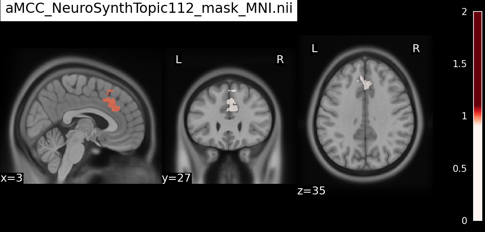
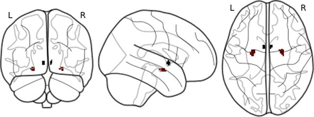
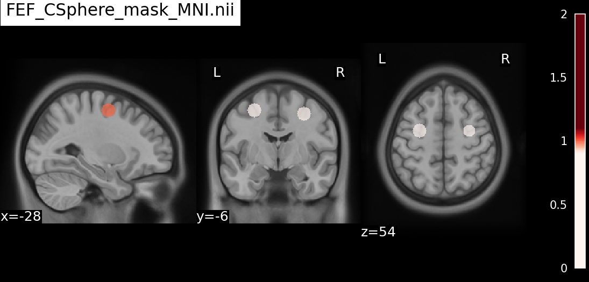
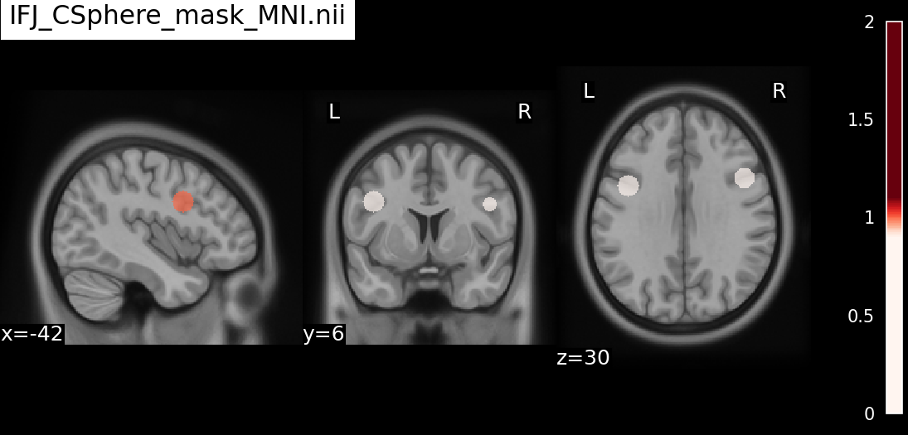
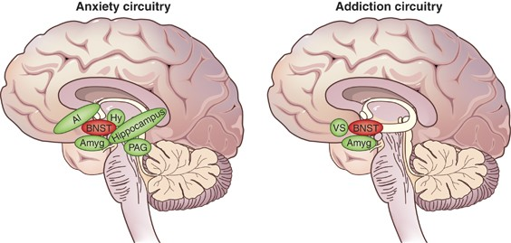

# masks/standardized/: Usable Mask List

Space: `MNI152NLin2009cAsym` res=1mm (shape 193×229×193)  
Generated by: `run/step02_prepare_masks.ipynb`  
Updated: 2026-08-21

---

## Naming convention

```
{structure}_{source}[_{parameter}]_mask_MNI.nii.gz
```

**Masks are bilateral. Side is not in the name**, `run_reg.py` (step 3) splits
them into `_L` / `_R` in native space, and everything downstream selects with
`--side`. A mask carrying `left`/`right`/`_L` in its own name meant the side was
tracked in two places at once, and produced filenames like
`aHipp_Weizhen_p05_L`.

**No construction expressions.** `rHipp_BN` recorded how step 02
built the mask (a boolean OR of two atlas parcels); that belongs in this
document, not in the filename. It is `rHipp_BN`.

**Source is always present**, so a mask can be traced without opening this file:
`BN` Brainnetome, `CIT168`, `Maass2015`, `Blackford2022`, `Dahl2022`,
`NeuroSynth112`, `Weizhen`, `sphere8` (8 mm coordinate sphere).

**Parameter** carries a threshold or variant when one exists, `_p01`, `_p05`
are significance levels, not probabilities, so p05 is the *larger* mask
(763 voxels against 417).

### Exception: left-only masks

`aHipp_Weizhen_*` exists for the left hemisphere only; there is no right-side
source. It therefore cannot follow the bilateral rule, and **step 3's L/R split
will produce an empty `_R`**. Use it with `--side _L` or `--side ""`.

### `aux/`

Not targets. `MNI_hemispheres_BN_1mm.nii.gz` (the hemisphere map, which has
parcellation coverage holes, see `run_reg.py`), `aMCC_bounding_box`, and
`aux/superseded/` holding the pre-merge EC left/right masks.

---

## 1. aMCC: Anterior Mid-Cingulate Cortex

### aMCC_NeuroSynth112_mask_MNI.nii.gz

| Item | Detail |
|---|---|
| ROI | Anterior mid-cingulate cortex (aMCC), NeuroSynth topic 112 (cognitive control) |
| Source | NeuroSynth topic map `v5-topics-400_112_*.nii.gz`, thresholded + bounding box applied |
| Created | 2025-07-17 |
| Notebook | `z_old_scripts/TUS_aMCCmask.ipynb` |



---

### aMCC_bounding_box_mask_MNI.nii.gz

| Item | Detail |
|---|---|
| ROI | Anterior mid-cingulate cortex (aMCC), hand-drawn bounding box |
| Source | Manually defined bounding box around aMCC in MNI space |
| Created | 2025-07-17 |
| Notebook | `z_old_scripts/TUS_aMCCmask.ipynb` |

---

## 2. BNST: Bed Nucleus of the Stria Terminalis

### BNST_Blackford2022_mask_MNI.nii.gz

| Item | Detail |
|---|---|
| ROI | Bed nucleus of the stria terminalis (BNST), bilateral |
| Source | Blackford et al. 2022 BNST mask (3T, ANTs-registered) |
| Created | 2026-03-22 |
| Notebook | `z_old_scripts/TUS_amygdala_mask.ipynb` |



---

## 3. CeA: Central Nucleus of the Amygdala

### CeA_CIT168_mask_MNI.nii.gz

| Item | Detail |
|---|---|
| ROI | Central nucleus of the amygdala (CeA), bilateral |
| Source | CIT168 atlas, bilateral CeA (partial volume) |
| Created | 2026-03-22 |
| Notebook | `z_old_scripts/TUS_amygdala_mask.ipynb` |

*(see BST reference image above)*

---

## 4. FEF: Frontal Eye Field

### FEF_sphere8_mask_MNI.nii.gz

| Item | Detail |
|---|---|
| ROI | Frontal Eye Field (FEF), bilateral spheres r=8mm |
| Source | Coordinate-based sphere (MNI peak coords from literature) |
| Created | 2026-03-22 |
| Notebook | `run/step02_prepare_masks.ipynb` Step 2d |



---

## 5. IFJ: Inferior Frontal Junction

### IFJ_sphere8_mask_MNI.nii.gz

| Item | Detail |
|---|---|
| ROI | Inferior Frontal Junction (IFJ), bilateral spheres r=8mm |
| Source | Coordinate-based sphere (MNI peak coords from literature) |
| Created | 2026-03-22 |
| Notebook | `run/step02_prepare_masks.ipynb` Step 2d |



---

## 6. LC: Locus Coeruleus

### LC_Dahl2022_mask_MNI.nii.gz

| Item | Detail |
|---|---|
| ROI | Locus coeruleus (LC), bilateral, 76 voxels |
| Source | Dahl et al. 2022 LC meta-mask (`metaMask_Dahl2022/LCmetaMask_MNI05_s01f_plus50.nii.gz`), resampled to 1mm NLin2009cAsym |
| Created | 2026-03-22 |
| Notebook | `run/step02_prepare_masks.ipynb` Step 2c |



---

## 7. Insula: Brainnetome Atlas (BN)

### dIa_BN_mask_MNI.nii.gz

| Item | Detail |
|---|---|
| ROI | Dorsal agranular insula (dIa), bilateral, 3905 voxels |
| Source | Brainnetome Atlas (BN) 246-region, 1mm |
| Created | 2026-03-22 |
| Notebook | `run/step02_prepare_masks.ipynb` Step 2b |

---

### dId_BN_mask_MNI.nii.gz

| Item | Detail |
|---|---|
| ROI | Dorsal dysgranular insula (dId), bilateral, 5315 voxels |
| Source | Brainnetome Atlas (BN) 246-region, 1mm |
| Created | 2026-03-22 |
| Notebook | `run/step02_prepare_masks.ipynb` Step 2b |

---

### dIg_BN_mask_MNI.nii.gz

| Item | Detail |
|---|---|
| ROI | Dorsal granular insula (dIg), bilateral, 4434 voxels |
| Source | Brainnetome Atlas (BN) 246-region, 1mm |
| Created | 2026-03-22 |
| Notebook | `run/step02_prepare_masks.ipynb` Step 2b |

---

### vIa_BN_mask_MNI.nii.gz

| Item | Detail |
|---|---|
| ROI | Ventral agranular insula (vIa), bilateral, 3559 voxels |
| Source | Brainnetome Atlas (BN) 246-region, 1mm |
| Created | 2026-03-22 |
| Notebook | `run/step02_prepare_masks.ipynb` Step 2b |

---

## 8. OFC: Orbitofrontal Cortex

### A13_BN_mask_MNI.nii.gz

| Item | Detail |
|---|---|
| ROI | OFC area 13 (A13), bilateral, 13755 voxels |
| Source | Brainnetome Atlas (BN) 246-region, 1mm |
| Created | 2026-03-22 |
| Notebook | `run/step02_prepare_masks.ipynb` Step 2b |

---

## 9. Hippocampus: Brainnetome Atlas (BN)

### rHipp_BN_mask_MNI.nii.gz

| Item | Detail |
|---|---|
| ROI | Rostral hippocampus (rHipp), bilateral, 8579 voxels |
| Source | Brainnetome Atlas (BN) 246-region, 1mm |
| Created | 2026-03-22 |
| Notebook | `run/step02_prepare_masks.ipynb` Step 2b |

---

### hipp_BN_mask_MNI.nii.gz

| Item | Detail |
|---|---|
| ROI | Rostral + caudal hippocampus (rHipp + cHipp), bilateral, 18205 voxels |
| Source | Brainnetome Atlas (BN) 246-region, 1mm |
| Created | 2026-03-22 |
| Notebook | `run/step02_prepare_masks.ipynb` Step 2b |

---

### cHipp_BN_mask_MNI.nii.gz

| Item | Detail |
|---|---|
| ROI | Caudal hippocampus (cHipp), bilateral, 9626 voxels, CoG (2, −29, −10) |
| Source | Brainnetome Atlas (BN) 246-region, 1mm |
| Created | 2026-03-22 |
| Notebook | `run/step02_prepare_masks.ipynb` Step 2b |
| QC image | none |

---

## 10. Entorhinal cortex: Maass et al. 2015 functional subdivision

> **Merged 2026-08-21.** Maass supplies left and right separately; they are
> now combined into one bilateral mask each, split by step 3 like every
> other target. The two sides do not touch, 22–28 mm apart, nothing inside
> |x| < 1 mm, so the x-sign split reproduces the originals exactly
> (1185 + 1125 and 441 + 507). The pre-merge files are in
> `aux/superseded/`. Do **not** split these with the Brainnetome hemisphere
> map: it has coverage holes over entorhinal cortex and drops 18–20 %.

Anterolateral (alEC) and posteromedial (pmEC) entorhinal cortex, defined by
resting-state connectivity preference: alEC couples with perirhinal cortex
(PRC), pmEC with parahippocampal cortex (PHC). This is the standard functional
parcellation of human EC, and it is what "anterior vs posterior EC" refers to:
the axis is anterolateral↔posteromedial, not a straight A–P cut.

The two are 7 mm apart in y and 5 mm in z. **pmEC is less than half the size of
alEC** (441 vs 1185 voxels on the left), which matters for TUS: the −3 dB focal
lobe measured on this pipeline is ~5 mm across laterally and 45–55 mm long
axially, so pmEC is small relative to the axial extent.

### alEC_PRCpref_left_Maass2015_mask_MNI.nii.gz

| Item | Detail |
|---|---|
| ROI | Anterolateral entorhinal cortex, left, 1185 voxels, CoG (−18, −10, −31) |
| Source | Maass et al. 2015, *eLife* 4:e06426, PRC-preferring EC subregion |
| QC image | `alEC_PRCpref_left_Maass2015_mask_MNI_QC.png` |

---

### alEC_PRCpref_right_Maass2015_mask_MNI.nii.gz

| Item | Detail |
|---|---|
| ROI | Anterolateral entorhinal cortex, right, 1125 voxels, CoG (20, −10, −32) |
| Source | Maass et al. 2015, *eLife* 4:e06426 |
| QC image | none |

---

### pmEC_PHCpref_left_Maass2015_mask_MNI.nii.gz

| Item | Detail |
|---|---|
| ROI | Posteromedial entorhinal cortex, left, 441 voxels, CoG (−18, −17, −26) |
| Source | Maass et al. 2015, *eLife* 4:e06426, PHC-preferring EC subregion |
| QC image | `pmEC_PHCpref_left_Maass2015_mask_MNI_QC.png` |

---

### pmEC_PHCpref_right_Maass2015_mask_MNI.nii.gz

| Item | Detail |
|---|---|
| ROI | Posteromedial entorhinal cortex, right, 507 voxels, CoG (20, −17, −26) |
| Source | Maass et al. 2015, *eLife* 4:e06426 |
| QC image | none |

---

## 11. Hippocampus: Weizhen masks

**Kept separate from the Brainnetome hippocampus above; the two are not
interchangeable.** Different atlas, different extent, different laterality: the
Weizhen anterior mask is left-only and 763 voxels, the Brainnetome rHipp is
bilateral and 8579. Do not pair a Weizhen anterior mask with a Brainnetome
caudal mask as an anterior/posterior contrast, for that, use rHipp and cHipp,
which come from the same parcellation.

The `0.01` / `0.05` suffix is the threshold applied when the mask was made;
`0.05` is the more permissive and therefore the larger.

### aHipp_Weizhen_p05_mask_MNI.nii.gz

| Item | Detail |
|---|---|
| ROI | Anterior hippocampus, left, 763 voxels, CoG (−22, −5, −16) |
| Source | Weizhen mask, threshold 0.05 |
| QC image | none |
| Used by | sub-z002, sub-z004, the hippocampus runs through step 5 |

---

### aHipp_Weizhen_p01_mask_MNI.nii.gz

| Item | Detail |
|---|---|
| ROI | Anterior hippocampus, left, 417 voxels, CoG (−21, −6, −18) |
| Source | Weizhen mask, threshold 0.01 |
| QC image | `aHipp_Weizhen_p01_mask_MNI_QC.png` |

---

### aHipp_Weizhen_p01_untrimmed_mask_MNI.nii.gz

| Item | Detail |
|---|---|
| ROI | Anterior hippocampus, 456 voxels, CoG (−20, −5, −17). **Named as if bilateral but is left-only**; the right side is empty. | 
| Source | Weizhen mask, threshold 0.01 |
| QC image | `aHipp_Weizhen_p01_untrimmed_mask_MNI_QC.png` |

---

**Removed 2026-08-09:** `hippocampus_anterior_R_Weizhen_0.01_mask_MNI.nii.gz`
and its QC image contained **0 voxels**. Nothing in the pipeline referenced
them and no subject had a native-space copy. There is currently no right
anterior hippocampus mask in the Weizhen set; use the Brainnetome rHipp, or
regenerate one, if the right side is needed.

---

*Total: 22 masks, all in MNI152NLin2009cAsym 1mm isotropic.*
*`MNI_hemispheres_BN_1mm.nii.gz` is not a target: it is the hemisphere label*
*volume used to split bilateral masks into `_L` / `_R`.*
